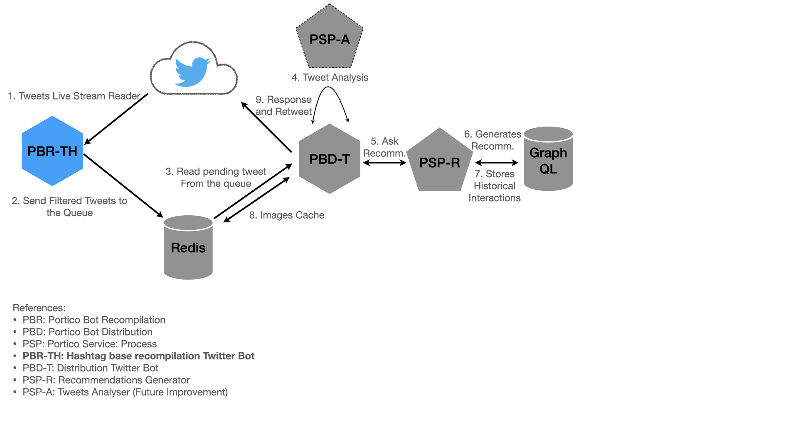

# Twitter Hashtag Recompiler Bot (PBR-TH)

A Tiwtter bot that listen to a single Hashtag, run some filter rules, and then send them to a Redis Queue.

## What's the use case?

The goal behind this tweeter bot is to give tweeter users the oportunity of asking for random recommendentions about certain topics to be define by the hashtag the bot is filtering. For instance, you could have the bot to respond with a random Simpsons Quote everytime someone tweet with hashtag #WhatWouldHomerDo. ¯\\_(ツ)_/¯

## Architecture



## Development

Since the Twitter credentias are sensitve data, they are not pushed in plain text but encrypted using [git-secrets](https://github.com/awslabs/git-secrets#description).

To run the service from local, follow these steps:

1. Decrypt the `.env.secret` file

2. Get the containers running:

   ```bash
   docker-compose up -d
   ```

3. Access the golang container to build and/or run the app.

   ```bash
   docker run exec -it pbr-th-local sh
   ```

4. Run your local code:

   ```bash
   go run ./cmd/app/...
   ```

### Building the Image

Use `docker build` command:

```bash
docker build --build-arg SHA1VER=`git rev-parse HEAD` -t porticolabs/pbr-th .
```

## Running the bot

Use the image locally built (or pull it from the [public repo](https://hub.docker.com/r/porticolabs/pbr-th)) to get the pod running.

To do it on your local machine you can use the following command:

```bash
docker run --rm --name pbr-th \
-e CONSUMER_KEY=XXA \
-e CONSUMER_SECRET=XXB \
-e ACCESS_TOKEN=XXC \
-e ACCESS_TOKEN_SECRET=XXD \
porticolabs/pbr-th
```

## Developing on local

If you're working on some changes to the app, you can run the code on your local with this docker command: 

```bash
docker run --rm --name pbr-th -it \
-v `pwd`:/go/src \
--workdir /go/src \
-e CONSUMER_KEY=XXA \
-e CONSUMER_SECRET=XXB \
-e ACCESS_TOKEN=XXC \
-e ACCESS_TOKEN_SECRET=XXD \
golang:1.15-alpine sh
```

Then, in the container use `go run` to test your code:

```bash
go run ./cmd/app/...
```

## How is this repository organized

It follows an standar GoLang project layout as described [here](https://github.com/golang-standards/project-layout).